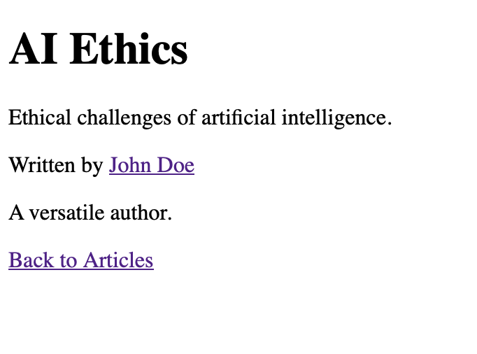

# Test_task_Multilingual_site_IMEX

### Setup

#### Clone the Repository:

```bash
git clone https://github.com/VasiaBirchak/Test_task_Multilingual_site_IMEX.git
```
### Create and Activate a Virtual Environment:
```bash
python3 -m venv venv
source venv/bin/activate
```
Install the Required Packages:

```bash
pip install -r requirements.txt
```
Apply Migrations:

```bash
python manage.py migrate
```
Create a Superuser:

```bash
python manage.py createsuperuser
```
Configuration Files:
.env: Stores sensitive data such as environment variables for connecting to the database.

## How to Use

Example .env File:

```bash
DB_NAME=multilingual_site
DB_USER=postgres
DB_PASSWORD=postgres
DB_HOST=localhost
DB_POSRT=5432
```
Run the Development Server:
```bash
python manage.py runserver
```


### Launching:
Use Django to run a local server.
Go to the web interface and use the functionality.
### Development and Testing

Install the Development Dependencies:

```bash
pip install -r requirements.txt
```
Run the Tests:

```bash
pytest
```
Project Structure

Models (articles/models.py)
Author: Represents an author with the following fields:
name: Author's name.
birthday: Date of birth.
about & about_short: Translatable fields for detailed and short descriptions.
Includes:

get_about(language_code): Fetches the "about" content in the specified language.
Article: Represents an article with the following fields:
slug: Unique identifier for the article.
date_added: Timestamp when the article was created.
title & content: Translatable fields for title and content.
author: Foreign key linking to an Author.
Includes:

get_title(language_code): Fetches the article title in the specified language.
get_content(language_code): Fetches the article content in the specified language.


API Views (api/views.py)
ArticleListView:
Endpoint: /api/articles/
Retrieves a list of articles.
Supports a q query parameter to search articles by English title or content.
AuthorListView:
Endpoint: /api/authors/
Retrieves a list of authors.
Supports a q query parameter to search authors by name.


## FEATURE
All information is given to the user in his language. Determining the user's language by the HTTP Accept-Language header, if the desired language is not in "Languages" or the corresponding model field is empty or undefined - return data in English. For example, you can change the language in the settings

 - **Language Settings:**
 

 - **Request with Accept-Language uk:**
 

 - **API article ist:**
 

 - **API article list with query parameter:**
 

- **Home page (Article List):**


- **Home page (Article List English):**


- **Article Detail:**
 

- **Article Detail English:**
 

- **Authors List:**
 

- **Author Detail:**
 

- **Author Detail English:**
 
